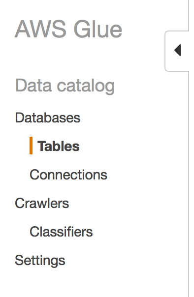
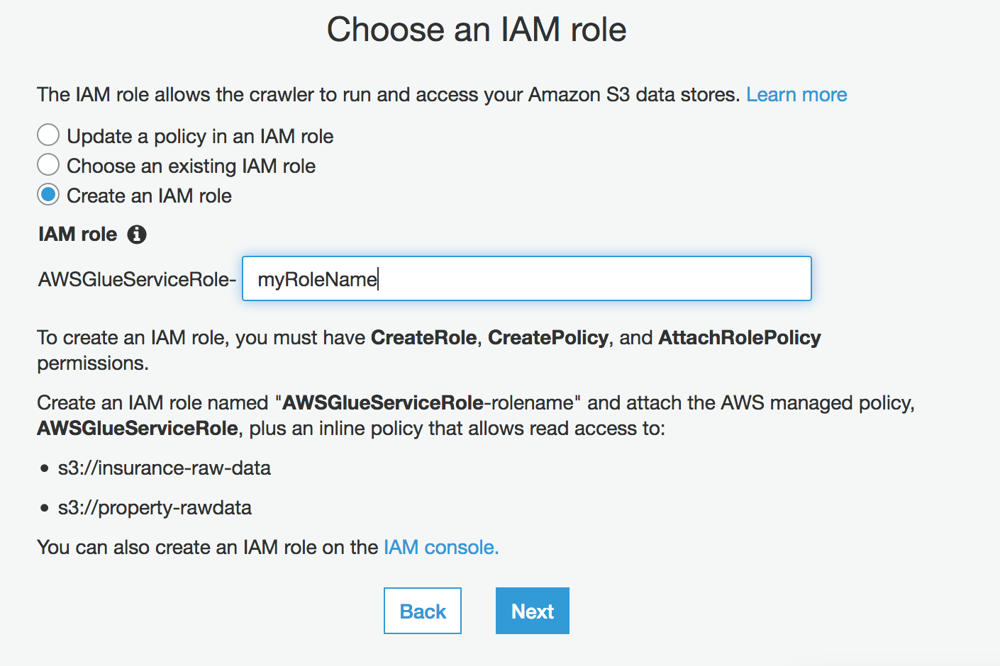
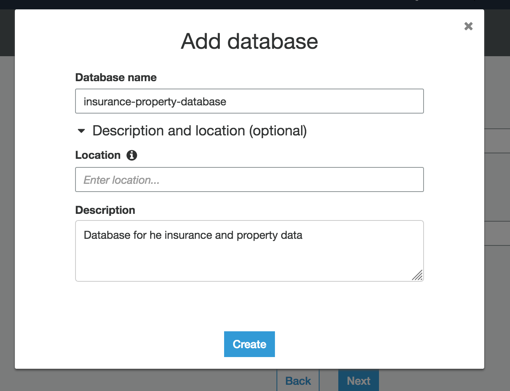
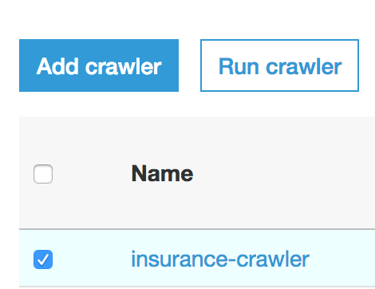

# Lesson 2

On this lesson we will be setting up the initical crawler to map the csv file. 

1. Open the AWS GLue Service on you console
2. On the left panel, click on Tables

3. On top click Add Tables -> Add tables using a crawler

## Creating a Crawler
 1. Add you crawler name (e.g insurance-property-crawler)

[Optional]you may add some tags

2. As data source choose Data stores option

3. Choose the insurance-data-bucket
4. Add another data source and choose property-data-bucket
5. on the IAM role opetion, select "Create an IAM Role"and type the role name. Click Next

6. Choose the frequency you desire the crawler to run
7. On the output section

    7.1 click "add Database"and add the db information. Click Create

8. You can leave the rest as default

9. review and click finish

## Running the crawler

Select your crawler and click on "Run Crawler"

After its stoped you can see